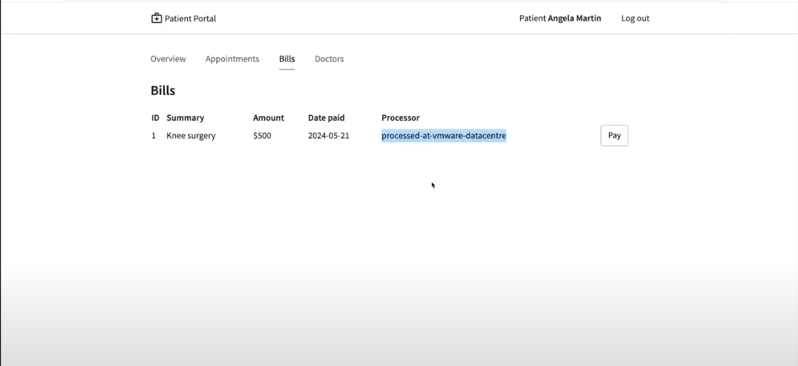
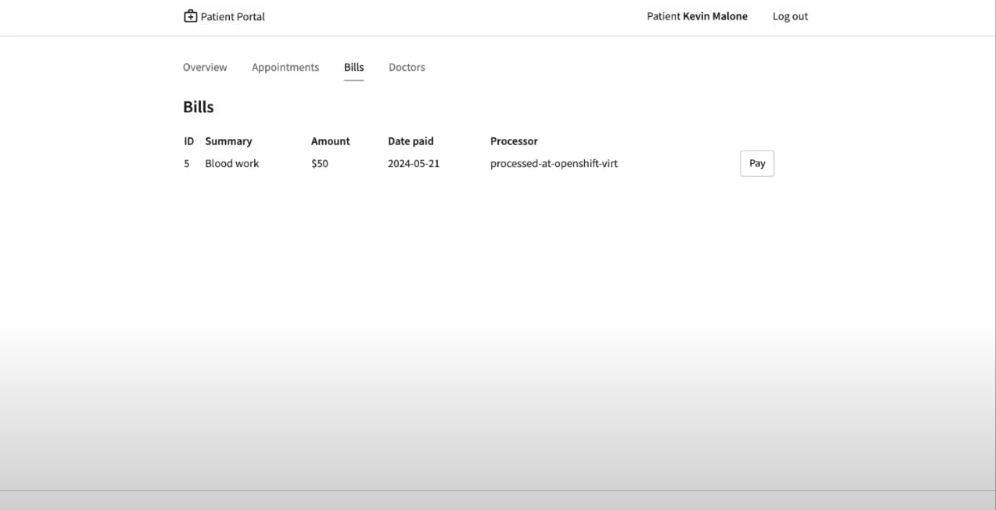

# RHSI_VMware_OpenShiftvirt

## Prerequisites
1. A virtual machine running RHEL 9 on any of the Vmware platforms. Vsphere, [Vmware fusion or Vmware workstation](https://blogs.vmware.com/teamfusion/2024/05/fusion-pro-now-available-free-for-personal-use.html) . We will deploy the database and payment processor here. 

2. A similar virtual machine running RHEL 9 on [OpenShift Virtualization](https://cloud.redhat.com/learn/getting-started-red-hat-openshift-virtualization?extIdCarryOver=true&intcmp=7013a000003SVWoAAO&sc_cid=7013a000003SpZ3AAK). We will migrate the payment processor here.

3. Install podman on both the VMs to run the application containers.  

4. An OpenShift cluster to deploy the frontend of the application. You could use the [Red Hat Developer Sandbox](https://developers.redhat.com/developer-sandbox)


## Setup
* Enable podman socket on both VMs

    **VMware**
    ```
    systemctl --user enable podman.socket
    loginctl enable-linger lab-user
    systemctl --user start podman.socket
    ```

    **OpenShift Virt**
    ```
    systemctl --user enable podman.socket
    loginctl enable-linger lab-user
    systemctl --user start podman.socket
    ```


* Install skupper 

    **VMware**
    ```
    curl https://skupper.io/install.sh | sh -s
    ```

    **OpenShift Virt**
    ```
    curl https://skupper.io/install.sh | sh -s
    ```

    **Terminal used to login to the OpenShift Cluster**
    ```
    curl https://skupper.io/install.sh | sh -s
    ```

* Install the frontend on the **OpenShift Cluster**
    ```
    oc new-project frontend
    oc apply -f https://raw.githubusercontent.com/rpscodes/Patient-Portal-Deployment/main/patient-portal-frontend-deploy.yaml
    ```


* Install the Database and payment processor on **VMware**
    ```
    podman run --name portal-database --detach --rm -p 5432:5432 quay.io/redhatintegration/patient-portal-database:devnation 

    podman run --name portal-payments --hostname processed-at-vmware-datacentre --detach --rm -p 8080:8080 quay.io/redhatintegration/patient-portal-payment-processor:devnation

    ```

### Connect VMware (Database and Payment Processr) to OpenShift(frontend)
* Initialize Service Interconnect 
    **OpenShift Cluster**
    ```
    skupper init --enable-console --enable-flow-collector --console-auth unsecured
    ```

* Create connection token
    **OpenShift Cluster**
    ```
    skupper token create secret_vmware.token
    ```

* Display the token and copy it in a text editor
    **OpenShift Cluster**
    ```
    cat secret_vmware.token
    ```
* Initialize Service Interconnect
    **VMware**
    ```
    export SKUPPER_PLATFORM=podman

    skupper init

    ```

* Create a new file on the VM and save the contents of the token in it
    **VMware**
    ```
    vi secret_vmware.token

    ```

* Create the link
    **VMware**
    ```
    skupper link create secret_vmware.token --name openshift-to-vm

    ```

* Expose the database and payment processor over the network
    **VMware**
    ```
    skupper expose host portal-database --address database --port 5432

    skupper expose host portal-payments --address payment-processor --port 8080 --protocol http


    ```

* Create the corresponding virtual service on the OpenShift Cluster
    **OpenShift Cluster**
    ```
    skupper service create database 5432

    skupper service create payment-processor 8080 --protocol http

    ```

* Open the link of the front end route and you should see a list of patients and should be able to make a payment to one of the patients. The application also displays where you payment was processed. Currently it should show that it was processed as VMware




## Connect the OpenShift Cluster (frontend) to the OpenShift Virtualization VM (Database and Payment Processor)

Now let's connect the OpenShift Cluster to the OpenShift Virtualization VM. After that we'll be able to seamlessly switch over the traffic from VMware to OpenShift Virtualization.

* Initialize Service Interconnect
    **OpenShift Virt**
    ```
    export SKUPPER_PLATFORM=podman

    skupper init

    ```

* Create connection token
    **OpenShift Cluster**
    ```
    skupper token create secret_virt.token
    ```

* Display the token and copy it in a text editor
    **OpenShift Cluster**
    ```
    cat secret_virt.token
    ```

* Create a new file on the VM and save the contents of the token in it 
    **OpenShift Virt**
    ```
    vi secret_virt.token
    ```

* Create the link
    **OpenShift Virt**
    ```
    skupper link create secret_virt.token --name virt-to-openshift
    ```
* Expose the database and payment processor over the network
    **OpenShift Virt**
    ```
    skupper expose host portal-database --address database --port 5432 

    skupper expose host portal-payments --address payment-processor --port 8080 --protocol http
    ```

* Delete the connection between VMware and OpenShift cluster
    **VMware**
    ```
    skupper delete
    ```

* Now you should see the traffic is automatically switched to OpenShift Virtualization


## Conclusion

## Troubleshooting


 


